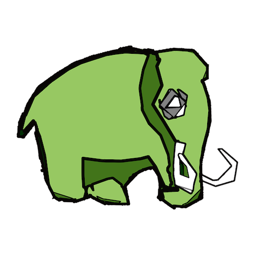
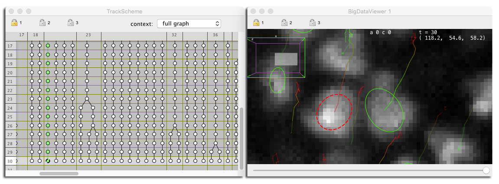
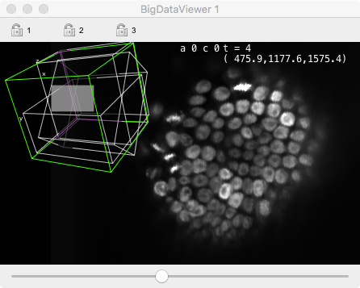
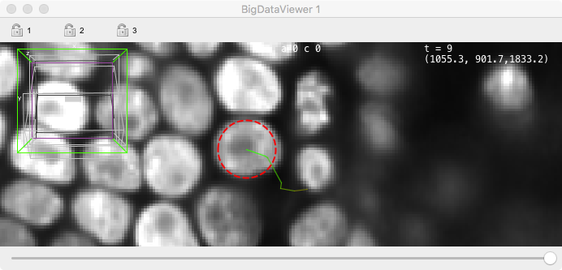
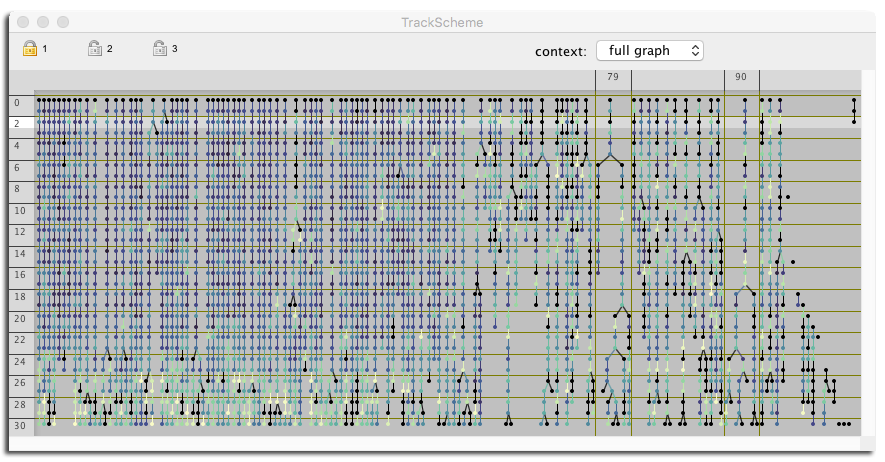
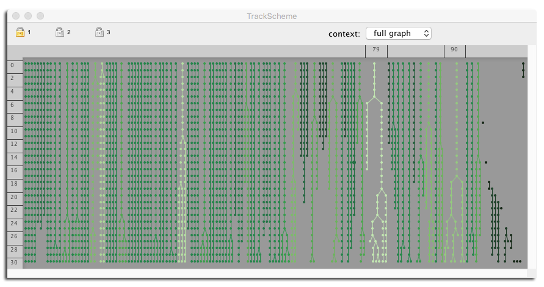

# Mastodon – a large-scale tracking and track-editing framework for large, multi-view images.

Modern microscopy technologies such as light sheet microscopy allows live sample *in toto* 3D imaging with high spatial and temporal resolution. Such images will be 3D over time, possibly multi-channels and multi-view. Computational analysis of these images promises new insights in cellular, developmental and stem cells biology. However, a single image can amount to several terabytes, and in turn, the automated or semi-automated analysis of these large images can generate a vast amount of annotations. The challenges of big data are then met twice: first by dealing with a very large image, and second with generating large annotations from this image. They will make interacting and analyzing the data especially difficult.

**Mastodon** is our effort to provide a tool that can harness these challenges. 

## *Warning.*

Despite the naming of the artifacts and the apparent usability of the software, *Mastodon is still in alpha stage, not released, not published and not supported* at the present time.

## Mastodon goals.

The goals of Mastodon are the following:

- **Interactive** browsing, inspection and navigation through the image data. Fast and responsive.
- Build **tracking and lineage data** from images.
- **User-friendly** framework to navigate through this data. Easy to relate spatial information with hierarchical information. Easily orient the user in a possibly very large annotation.
- "Point-wise" **interactive editing** of the tracking and lineage data. Manual curation.
- **Semi-automatic and fully automatic tracking**.
- **Numerical features** and statistics on tracking data. **Tagging of this data**. Tags and numerical features can then be used to to enrich the visualization.
- **Extensible**: a 3rd party can build plugins for Mastodon:
  - Custom numerical feature analysers;
  - Custom tracking algorithms (detection and particle-linking algorithms);
  - General-use plugins.

## Mastodon components.

### BDV windows.

Display image data and overlay the tracking data. Single objects (spots or links) can be individually edited.

### TrackScheme windows.

TrackScheme is used to display a hierarchical view of the lineage data. The tracks are arranged from left to right, and time is laid out from top to bottom.

## Mastodon technologies.

Mastodon is a Java software that relies on several technologies to achieve these goals, specially developed for it.

*Interactive visualization and navigation of large images thanks to the BigDataViewer* ([BDV](https://imagej.net/BigDataViewer). Any file that can be opened in the BDV will work in Mastodon (BDV HDF5 file format, KLB, Keller-Lab Blocks file format, N5 file format, ...). These file formats enable interactive visualization of multi-view TB dataset at the one-time cost of a file conversion. Also, they can be exploited for efficient image processing in special cases, taking advantage of multi-scale pyramidal representation and blocks decomposition. 

*[Mastodon-collection](https://github.com/mastodon-sc/mastodon-collection): a high performance framework to manipulate collections of data*. Mastodon-collection was developed specifically for this project. It offers an in-memory compact layout storage of objects. Mastodon collections have a much smaller memory footprint. Objects in a mastodon collection are contiguous in memory. Thanks to CPU cache and [data locality](http://gameprogrammingpatterns.com/data-locality.html), iterating these collections is much faster than classical object collections. Mastodon-collection also offers techniques to do garbage-collection-free manipulations in Java, considerably improving the responsiveness of applications based on it.

*[Mastodon-graph](https://github.com/mastodon-sc/mastodon-graph): a data structure based on mastodon-collection, and optimized for lineage and tracking data.* Mastodon-graph is a graph library based on mastodon-collections, that underlies the data model of Mastodon.

*Efficient retrieval of objects in space and time*. User interactions with tracking objects rely on [Kd-tree search on convex polytopes](http://fly.mpi-cbg.de/~pietzsch/polytope.pdf).

*Level of detail to display large number of objects*. TrackScheme automatically adapts the level of detail while displaying data at varying scales.

## Usage.

### Actions and keyboard shortcuts.

The keyboard shortcuts listed below are valid for the _default_ key-map.

#### BigDataViewer (BDV) windows.

##### Moving around and display in BDV windows.

| Action                           | Key                                                          |
| -------------------------------- | ------------------------------------------------------------ |
| _View._                          |                                                              |
| Move in X & Y.                   | Right-click and drag.                                        |
| Move in Z.                       | Mouse-wheel. Press and hold shift to move faster, control to move slower. |
| Rotate.                          | Click and drag. The view will rotate around the location you clicked. |
| Align view with X /  Y / Z axes. | - Align with XY plane: `Shift-Z`  - Align with YZ plane: `Shift-X`  -  Align with XZ plane: `Shift-C` or `Shift-Y`     The view will rotate around the location you clicked. |
| Zoom / Unzoom.                   | `Control-shift mouse-wheel` or `Command-mouse-wheel`. The view will zoom and unzoom around the mouse location. |
| _Time-points._                   |                                                              |
| Next time-point.                 | `]` or `M`                                                   |
| Previous time-point.             | `[` or `N`                                                   |
| _Bookmarks._                     |                                                              |
| Store a bookmark.                | `Shift-B` then press any key to store a bookmark with this key as name. A bookmark stores the position, zoom and orientation in the view but not the time-point. Bookmarks are saved in display settings file. |
| Recall a bookmark.               | Press `B` then the key of the bookmark.                        |
| Recall a bookmark orientation.   | Press `O` then the key of the bookmark. Only the orientation of the bookmark will be restored. |
| _Image display._                 |                                                              |
| Select source 1, 2, ...          | Press `1`, `2`, ...                                              |
| Brightness and color dialog.     | Press `S`. In this dialog you can adjust the min & max for each source, select to what sources these min & max apply and pick a color for each source. |
| Toggle fused mode.               | Press `F`. In fused mode, several sources are overlaid. Press `Shift-1`, `Shift-2`, … to add / remove the source to the view. In single-source mode, only one source is shown. |
| Visibility and grouping dialog.  | Press `F6`. In this dialog you can define what sources are visible in fused mode, and define groups of sources for use in the grouping mode. |
| Save / load display settings.    | `F11` / `F12`. This will create a XYZ_settings.xml file in which the display settings will be saved. |

##### Manual editing and navigation in BDV windows.

| Action                                    | Key                                                          |
| ----------------------------------------- | ------------------------------------------------------------ |
| _Editing spots._                          |                                                              |
| Add a new spot.                           | Press `A` with the mouse over the desired location.          |
| Remove a spot.                            | Press `D` with the mouse inside the spot to remove.          |
| Increase / Decrease the radius of a spot. | Press `E` / `Q` with the mouse inside the spot. `Shift-E` / `Q` increase / decrease the spot radius by larger steps. `Control-E` / `Q` enlarges the spot radius by finer steps. |
| Move a spot.                              | Press and hold `space` with mouse inside the spot to move, and move it around. |
| _Creating links between spots._           |                                                              |
| Create a link between two spots.          | Press and hold `L` with the mouse inside the source spot. The BDV moves to the next frame. Release `L` when inside the target spot. Press and hold `Shift-L` to do the same, but linking to the previous frame. |
| Remove a link.                            | Press `D` with the mouse on the link to remove.              |
| Create a spot linked to a spot.           | Press and hold `A` with the mouse inside the source spot. The BDV moves to the next frame. Release `A` at the desired position. A new spot is created, linked to the source spot. Press and hold `Shift-A` to do the same, but linking to the previous frame. |
| _Selection editing._                      |                                                              |
| Add a spot / link to the selection.       | `Shift-click` on a spot or a link to add / remove it to / from the selection. |
| Clearing the selection.                   | Click on an empty place of the image.                        |
| Remove selection content.                 | `Shift-delete`.                                              |
| _Undo / redo_.                            |                                                              |
| Undo.                                     | `Control-Z`.                                                 |
| Redo.                                     | `Control-shift-Z.`                                           |

#### TrackScheme windows.

##### Navigation through lineages in BDV and TrackScheme windows.

| Action                                     | Key                                                          |
| ------------------------------------------ | ------------------------------------------------------------ |
| _Navigation._                              |                                                              |
| Navigate to parent / child in time.        | `↑` / `↓`. Select and move to the spot linked to this one in the previous / next time-point. Press `shift` to also add it to the current selection. |
| Navigate to sibling.                       | `←` / `→`. Select and move to the sibling of this spot. A sibling is another spot from the same lineage in the same time-point. Press `Shift` to also add it to the current selection. |
| Navigate to branch parent / child in time. | `Alt + ↑` / `↓`. Select and move to the parent / child branch. A branch starts and ends with a division or fork in the lineage. Press `Shift` to also add it to the current selection. |
| Navigate to spot / link.                   | `Double-click` on the spot / link.                           |
| _Selection._                               |                                                              |
| Select all parents.                        | `Shift + ⇞`. Select all the parents of this spots, that is all the spots in its lineage backward in time. |
| Select all children.                       | `Shift + ⇟`. Select all the children of this spots, that is all the spots in its lineage forward in time. |
| Select all lineage.                        | `Shift + space`. Select all the spots of this spot lineage.  |

##### Moving around in TrackScheme windows.

| Action                  | Key                                                          |
| ----------------------- | ------------------------------------------------------------ |
| _View._                 |                                                              |
| Move around.            | `Right-click` and `drag` or `mouse-wheel`.                   |
| Zoom / unzoom in X.     | `Shift mouse-wheel`.                                         |
| Zoom / unzoom in Y.     | `Control-mouse-wheel`.                                       |
| Zoom / unzoom in X & Y. | `Control-shift-mouse-wheel`.                                 |
| Full zoom, full unzoom. | Press `Z`. The view zoom at max level to the mouse location. Pressing `Z` again to unzoom fully. |
| Zoom in a box.          | Press and hold `Z`, then drag a box. The view will zoom to the box. |

_TrackScheme box zoom:_
Drag a rectangle with the `Z` key pressed. TrackScheme will zoom to this rectangle. A press of `Z` fully zoom to designated location.
If TrackScheme is fully zoomed, a tap of `Z` unzoom fully.

##### Manual track editing in TrackScheme windows.

| Action                              | Key                                                          |
| ----------------------------------- | ------------------------------------------------------------ |
| _Editing spots._                    |                                                              |
| Remove a spot.                      | Press `D` with the mouse inside the spot to remove.          |
| Edit the label of a spot.           | Press `Enter` when a spot is focused, then enter its label and press `Enter` to validate. |
| _Creating links between spots._     |                                                              |
| Create a link between two spots.    | Press and hold `L` with the mouse inside the source spot. Release `L` when inside the target spot. |
| Remove a link.                      | Press `D` with the mouse on the link to remove.              |
| _Selection editing._                |                                                              |
| Add a spot / link to the selection. | `Shift-click` on a spot or a link to add / remove it to / from the selection. |
| Select all in a box.                | `Click and drag` a box. `Shift-click and drag` to add the content of the box to the current selection. |
| Clearing the selection.             | `Click` on an empty place of the image.                      |
| Remove selection content.           | `Shift-delete.`                                              |
| _Undo / redo._                      |                                                              |
| Undo.                               | `Control-Z`.                                                 |
| Redo.                               | `Control-shift-Z`.                                           |

